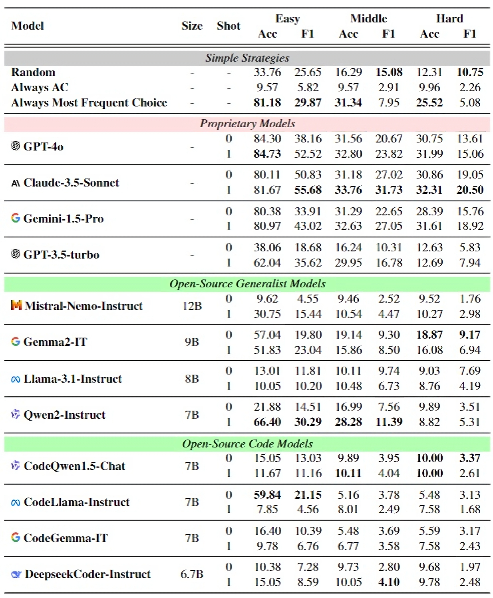

<p align="center">
    
<p>

<h3 align="center"><a href="" style="color:#9C276A">
CodeJudge-Eval:  Can Large Language Models be Good Judges in Code Understanding?</a></h3>
<h5 align="center"> If our project helps you, please give us a star ⭐ on GitHub to support us. 🙏🙏 </h2>

<h5 align="center">

[](https://huggingface.co/datasets/CodeResearch/CodeJudge-Eval)
[](???)
[](https://github.com/CodeLLM-Research/CodeJudge-Eval/LICENSE.txt) 

</h5>

## Introduction

Recent advancements in large language models (LLMs) have showcased impressive code generation capabilities, primarily evaluated through language-to-code benchmarks. However, these benchmarks may not fully capture a model's code understanding abilities. We introduce **CodeJudge-Eval (CJ-Eval)**, a novel benchmark designed to assess LLMs' code understanding abilities from the perspective of code judging rather than code generation. CJ-Eval challenges models to determine the correctness of provided code solutions, encompassing various error types and compilation issues. By leveraging a diverse set of problems and a fine-grained judging system, CJ-Eval addresses the limitations of traditional benchmarks, including the potential memorization of solutions. Evaluation of 12 well-known LLMs on CJ-Eval reveals that even state-of-the-art models struggle, highlighting the benchmark's ability to probe deeper into models' code understanding abilities.

## Experiment Results

<p align="center">
    
<p>

## More Details

This work is still in progress. More details will be released in the coming month.

## 📑 Citation

If you find **CodeJudge-Eval** useful for your research and applications, please cite using this BibTeX:
```bibtex

```